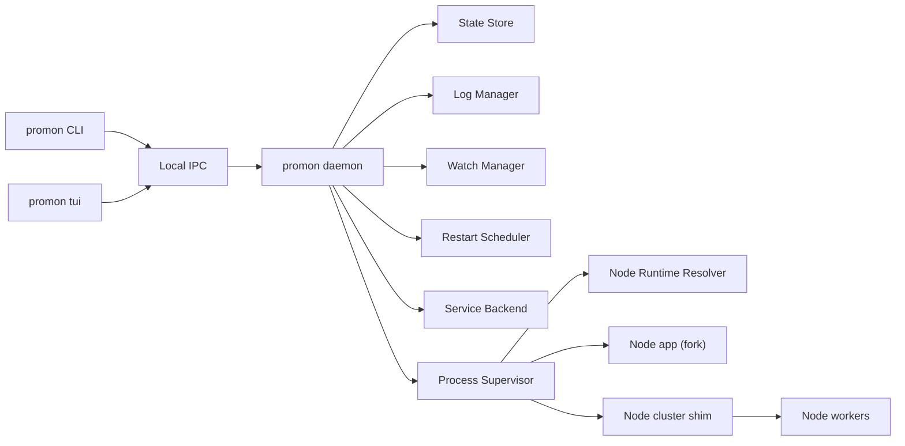

# Promon Module Design

## Architecture Overview

Promon has four major runtime surfaces:

- CLI: Parses user commands, renders output, and sends requests to the daemon.
- Daemon: Owns process supervision, desired state reconciliation, scheduling, log handling, and watch mode.
- TUI: Interactive terminal client that talks to the daemon through the same IPC API as the CLI.
- Node support shims: Small JavaScript/TypeScript runtimes used for JavaScript/TypeScript ecosystem config loading, cluster mode, and Node-specific worker coordination.



## Crate Responsibilities

### `promon-core`

Shared domain types:

- App identifiers.
- App status.
- Desired app specs.
- Runtime process specs.
- Restart policies.
- Log policies.
- Errors.

This crate should avoid OS APIs and async runtime coupling where possible.

### `promon-config`

Configuration parsing and validation:

- Detect config files.
- Parse JSON/TOML/YAML.
- Load JavaScript and TypeScript ecosystem configs by invoking a Node-side config loader, then validate the resulting JSON in Rust.
- Normalize relative paths.
- Merge environment overlays.
- Resolve `instances = "max"`.
- Parse memory units, cron expressions, watch specs, and log specs.

Output should be a validated `ResolvedAppSpec` from `promon-core`.

### `promon-process`

Process supervision:

- Spawn Node.js processes.
- Resolve JavaScript and TypeScript app launch commands.
- Support direct scripts, Node loaders, local binary runners, and package manager scripts.
- Track pid, start time, exit status, and restart count.
- Capture stdout/stderr.
- Gracefully stop processes.
- Force kill after timeout.
- Apply restart decisions.

This crate should expose a supervisor API that the daemon can drive.

### `promon-node-support`

Node-specific support that should stay outside generic process supervision:

- Runtime command resolution for JavaScript and TypeScript apps.
- Package manager detection from `package.json`.
- Local binary resolution from `node_modules/.bin`.
- Config-loader invocation for `ecosystem.config.js`, `.cjs`, `.mjs`, `.ts`, `.mts`, and `.cts`.
- Shared TypeScript loader configuration used by config loading, fork mode, and cluster mode.

This may be implemented as a Rust crate plus small bundled JavaScript files under `packages/node-support`.

### `promon-daemon`

Daemon orchestration:

- IPC server.
- Command handlers.
- Desired state reconciliation.
- Process event loop.
- Scheduler integration.
- Watch integration.
- State persistence.

The daemon should be the only component that mutates runtime process state.

### `promon-ipc`

Local IPC:

- Request/response enums.
- Version negotiation.
- Serialization.
- Unix domain socket transport.
- Windows named pipe transport.
- Client helper used by CLI and TUI.

The schema should be stable enough to support minor-version CLI/daemon skew.

### `promon-service`

System service integration:

- Linux systemd unit generation and lifecycle commands.
- macOS launchd plist generation and lifecycle commands.
- Windows Service install/uninstall/start/stop/status.
- Permission diagnostics.

This crate should not supervise apps directly. It only manages Promon daemon installation.

### `promon-platform`

Platform abstractions:

- Process metrics.
- CPU count.
- Signal/termination behavior.
- Path conventions.
- Lock files.
- User and permission checks.

### `promon-logging`

Log handling:

- Stream stdout/stderr to files.
- Provide tail/follow APIs.
- Rotate logs by size.
- Enforce retention.
- Render log events for CLI/TUI.

### `promon-watch`

Watch mode:

- File watchers.
- Glob filtering.
- Debounce.
- Event normalization.
- Restart/reload trigger dispatch.

### `promon-scheduler`

Scheduled restart support:

- Cron parsing.
- Interval timers.
- Next-run calculation.
- Trigger delivery to daemon.

### `promon-tui`

Terminal UI:

- Process list.
- App details.
- Logs panel.
- Action dialogs.
- IPC client polling/subscription.

Recommended library: `ratatui` with `crossterm`.

### `promon-cli`

Command-line entry point:

- Argument parsing.
- Human-readable output.
- JSON output option for automation.
- Daemon auto-start policy.
- Command dispatch.

Recommended library: `clap`.

## Process Model

## JavaScript and TypeScript Runtime Resolution

Promon must convert each app spec into a concrete command plan before spawning.

Supported command plans:

- Node script: `node <node_args> <script> <args>`.
- TypeScript loader: `node <node_args> <loader args> <script.ts> <args>`.
- Local runner: `<cwd>/node_modules/.bin/tsx <script.ts> <args>` or equivalent.
- Package script: `<package-manager> run <package_script> -- <args>`.
- Custom command: `<command> <args>`, limited to Node.js project workflows in the first release.

Resolution order:

1. Explicit config fields.
2. Local project binaries where configured.
3. Package manager from `package.json`.
4. System `PATH`.

Promon should validate the plan before handing it to the supervisor. It should report missing executables, missing package scripts, unsupported extensions, or missing TypeScript loaders before attempting a long-running daemon start where possible.

### Fork Mode

In fork mode, Promon directly starts:

```text
node <node_args> <script> <args>
```

Promon captures stdout/stderr and supervises the child process.

For TypeScript entrypoints, Promon starts the resolved command plan rather than assuming `node script.ts` will work.

### Cluster Mode

Cluster mode should use a Node-side shim:

```text
node <node_args> promon-cluster-shim.js --spec <encoded spec>
```

The shim:

- Starts a Node cluster primary process.
- Forks N workers.
- Applies worker environment.
- Applies the same JavaScript/TypeScript command plan rules used by fork mode.
- Listens for Promon control messages.
- Performs graceful worker replacement.
- Reports worker lifecycle events back to Promon.

Promon supervises the cluster primary process and treats workers as sub-processes with reported metadata.

IPC between Promon and the cluster shim can start with stdio JSON lines and later move to a local pipe if needed.

## Ecosystem Config Loader

JavaScript and TypeScript ecosystem configs are first-batch features. The config loader should be a small Node-side program that:

- Loads CommonJS, ESM, and TypeScript config files.
- Supports `module.exports` and `export default`.
- Accepts a config path and optional environment name.
- Emits plain JSON to stdout.
- Emits structured errors to stderr.
- Does not perform schema validation beyond ensuring the exported value is serializable.

Rust remains responsible for schema validation, defaulting, path normalization, and user-facing diagnostics.

## Restart Policy Engine

Inputs:

- Exit event.
- Manual operation context.
- Current app state.
- Restart policy.
- Backoff state.
- Memory threshold events.
- Schedule events.

Outputs:

- No action.
- Restart now.
- Restart after delay.
- Mark unstable.
- Stop permanently.

Policy fields:

- `autorestart`.
- `max_restarts`.
- `min_uptime`.
- `restart_delay`.
- `exp_backoff_restart_delay`.
- `max_backoff_delay`.

## State Store

Recommended initial durable model:

- SQLite database in Promon home.
- Migrations embedded in the binary.
- JSON payload columns allowed for config snapshots, but core state should be queryable.

Tables:

- `apps`: app id, name, namespace, desired state, resolved spec JSON, created/updated timestamps.
- `processes`: app id, worker id, pid, status, start time, stop time, restart count.
- `events`: app id, event type, message, timestamp.
- `service_installations`: platform, scope, service id, paths, status.
- `log_files`: app id, worker id, stream, path, sequence, size, created timestamp.

## IPC API Shape

Representative requests:

- `Ping`.
- `DaemonStatus`.
- `StartApps`.
- `StopTargets`.
- `RestartTargets`.
- `ReloadTargets`.
- `ScaleApp`.
- `ListApps`.
- `GetAppStatus`.
- `StreamLogs`.
- `ValidateConfig`.

Representative responses:

- `Ok`.
- `Error`.
- `AppList`.
- `AppStatus`.
- `LogEvent`.
- `OperationAccepted`.

Use a versioned envelope:

```json
{
  "version": 1,
  "request_id": "uuid",
  "kind": "ListApps",
  "payload": {}
}
```

## Service Backends

### Linux

Default to user-level systemd:

- Unit path: `~/.config/systemd/user/promon.service`.
- ExecStart: absolute path to Promon binary with daemon foreground mode.
- Enable with `systemctl --user enable promon`.

System-level install can be added through explicit flag:

- `/etc/systemd/system/promon.service`.

### macOS

Default to launchd user agent:

- Plist path: `~/Library/LaunchAgents/dev.promon.daemon.plist`.
- ProgramArguments: Promon binary with daemon foreground mode.
- Load with `launchctl bootstrap gui/<uid> ...`.

System-level install can target:

- `/Library/LaunchDaemons/dev.promon.daemon.plist`.

### Windows

Use Windows Service APIs:

- Service name: `Promon`.
- Binary path: Promon executable with daemon foreground mode.
- Support start, stop, status, and uninstall.

## Logging Design

Default layout:

```text
~/.promon/
  logs/
    <app-name>/
      out.log
      err.log
      combined.log
      workers/
        <worker-id>.out.log
        <worker-id>.err.log
```

Rotation:

- Trigger by size.
- Rename active file to numbered archive.
- Retain N archives.
- Reopen writer atomically.
- Notify tailers of rotation.

## TUI Design

The TUI should not read state files directly. It should:

- Poll or subscribe through IPC.
- Render stale state clearly if daemon connection is lost.
- Confirm destructive actions.
- Keep keyboard shortcuts predictable.

Recommended keys:

- `q`: Quit.
- `r`: Restart selected app.
- `R`: Reload selected app.
- `s`: Stop selected app.
- `a`: Start from config or selected app where applicable.
- `+`: Scale up.
- `-`: Scale down.
- `/`: Search.
- `Tab`: Switch panel.

## Error Handling

Use typed errors internally and user-focused messages at the CLI boundary.

Error messages should include:

- What failed.
- The path/app/command involved.
- Suggested next action where useful.

Examples:

- Missing Node.js binary.
- Invalid config field.
- Service installation permission denied.
- Daemon socket exists but daemon is not responding.
- App is crash-looping.
